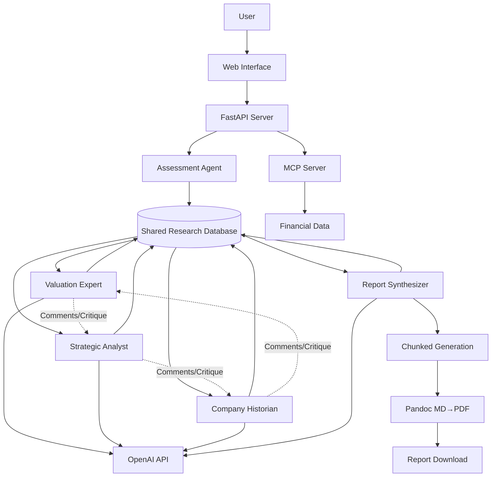
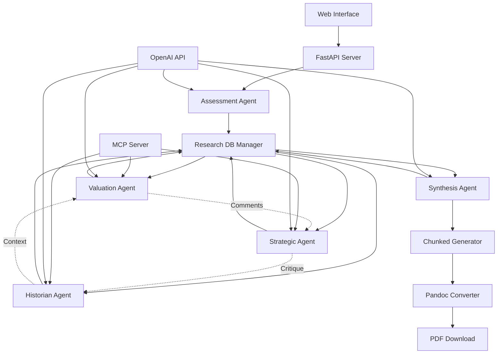
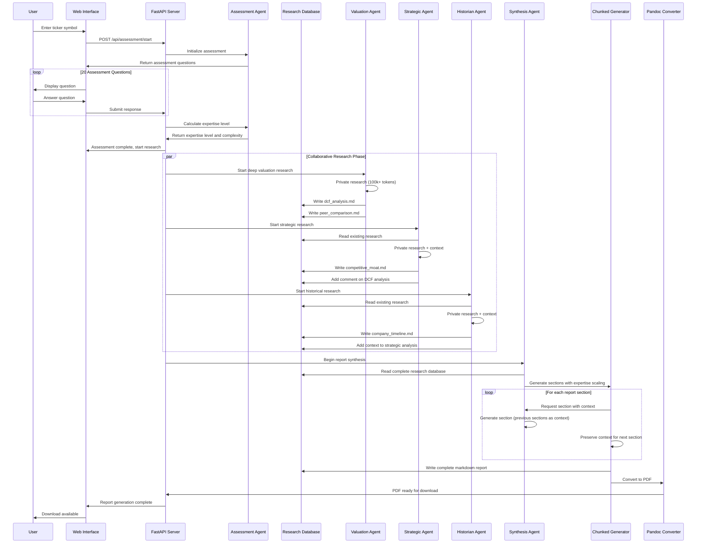
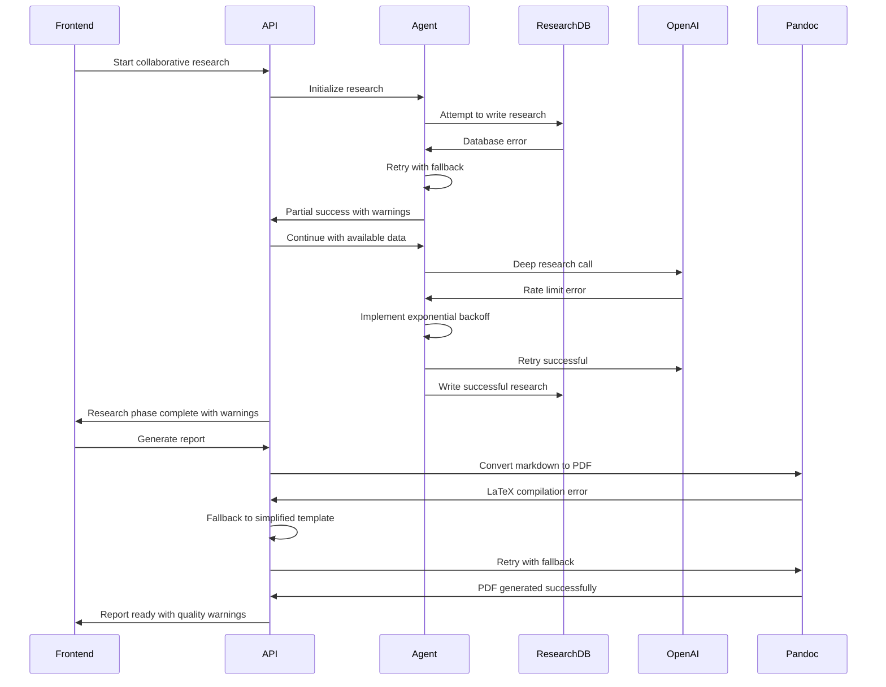

# StockIQ Architecture Document

## Introduction

This document outlines the complete architecture for StockIQ, a personal AI research tool that surpasses institutional investment research standards through a 5-agent collaborative multi-specialist architecture. This architecture serves as the single source of truth for AI-driven development, ensuring consistency across the entire technology stack.

The system replicates hedge fund-level research quality by deploying specialized AI agents that conduct deep private research and contribute distilled insights to a shared research database, producing 200-300 page comprehensive company analyses that beat institutional research depth while adapting output complexity to user expertise levels.

### Starter Template

**Decision:** N/A - Greenfield project

StockIQ is built from scratch with specific architecture requirements for collaborative multi-agent coordination and shared research database management. No existing starter templates match the unique combination of FastAPI orchestration with institutional-grade financial analysis and collaborative agent workflows.

### Change Log

| Date | Version | Description | Author |
|------|---------|-------------|---------|
| 2025-08-21 | v1.0 | Initial architecture document | Winston (Architect) |
| 2025-08-21 | v2.0 | Major revision: Collaborative agents with shared research database | Winston (Architect) |

## High Level Architecture

### Technical Summary

StockIQ employs a collaborative multi-agent architecture with FastAPI as the orchestration backbone, featuring 5 specialized AI agents that contribute to a shared research database through structured markdown files. Each agent conducts deep private research (100k+ tokens) using MCP, web scraping, and OpenAI calls, then distills findings into high-quality .md files shared with other agents. The frontend consists of a minimal HTML/JavaScript interface, while the backend coordinates agent collaboration and chunked report generation using Pandoc markdown-to-PDF conversion. This architecture achieves institutional-grade analysis quality through agent specialization and collaboration, producing adaptive report outputs with dynamic scaling based on user expertise levels.

### Platform and Infrastructure Choice

**Platform:** Local Windows 11 Development
**Key Services:** 
- FastAPI application server
- OpenAI SDK for direct API calls
- Pandoc for markdown-to-PDF conversion
- Shared research database (file-based .md system)
- MCP integration for real-time financial data
- Git-like versioning for research contributions
**Deployment Host and Regions:** Local development only - no cloud deployment required

### Repository Structure

**Structure:** Research-centric monorepo with shared knowledge base
**Monorepo Tool:** None - using research database structure
**Package Organization:** Agent-based directories with shared research database

### High Level Architecture Diagram



### Architectural Patterns

- **Collaborative Multi-Agent Research Database:** Agents contribute distilled insights via structured .md files while conducting deep private research - _Rationale:_ Enables institutional-grade depth without token limit violations, mimics real research team collaboration
- **Deep Research with Distilled Output:** Each agent can consume 100k+ tokens privately but only contributes high-quality summaries to shared context - _Rationale:_ Maximizes research depth while maintaining manageable shared context size
- **Markdown-Native Content Generation:** All outputs in markdown format for natural LLM writing and professional PDF conversion - _Rationale:_ LLMs write better markdown than HTML, Pandoc provides superior PDF formatting
- **Chunked Report Generation with Context Preservation:** Large reports generated in sections with rolling context from previous sections - _Rationale:_ Overcomes LLM output limits while maintaining coherence across 200-300 page reports
- **Dynamic Single Template Scaling:** One adaptive template that scales content based on expertise level - _Rationale:_ Simpler than multiple templates, allows fine-grained expertise-based customization

## Tech Stack

| Category | Technology | Version | Purpose | Rationale |
|----------|------------|---------|---------|-----------|
| Backend Language | Python | 3.11+ | Server logic and agent coordination | Excellent OpenAI SDK support, rich ecosystem for financial analysis |
| Backend Framework | FastAPI | 0.104+ | REST API and web interface | Auto-documentation, async support, minimal setup overhead |
| API Style | REST | OpenAPI 3.0 | Simple endpoints for assessment and reports | Straightforward for single-user application with limited endpoints |
| Frontend Language | JavaScript | ES2022 | Client-side interaction | Native browser support, minimal dependencies |
| Frontend Framework | Vanilla HTML/CSS/JS | N/A | Simple web interface | Eliminates complex framework overhead for basic ticker input and assessment |
| Authentication | None | N/A | Local-only application | Personal use application doesn't require auth complexity |
| Research Database | File-based .md system | N/A | Shared agent knowledge base | Natural for LLM reading/writing, version controllable, human readable |
| AI Integration | OpenAI SDK | 1.0+ | Direct API calls to GPT models | Official SDK provides optimal prompt control and structured outputs |
| PDF Generation | Pandoc | 3.0+ | Markdown to PDF conversion | Superior formatting, mature ecosystem, designed for academic/professional documents |
| LaTeX Engine | XeLaTeX | Latest | Professional PDF typography | Best-in-class document formatting for institutional reports |
| Data Validation | Pydantic | 2.0+ | Request/response validation | Type safety and automatic validation for agent data structures |
| HTTP Client | httpx | 0.25+ | MCP integration and external APIs | Async-first HTTP client that integrates well with FastAPI |
| Environment Config | python-dotenv | 1.0+ | Environment variable management | Simple configuration for API keys and settings |
| Code Formatting | ruff | 0.1+ | Code formatting and linting | Fast Python formatter following project CLAUDE.md standards |
| Development Server | uvicorn | 0.24+ | ASGI server for FastAPI | High-performance server with auto-reload for development |
| Markdown Processing | python-markdown | 3.5+ | Markdown parsing and manipulation | For merging and processing .md files between agents |

## Data Models

### Session Management Models

**UserSession**: Pydantic model for assessment + context
```python
from pydantic import BaseModel, Field
from typing import List, Optional
from datetime import datetime

class UserSession(BaseModel):
    session_id: str = Field(..., description="Unique session identifier")
    ticker_symbol: str = Field(..., description="Company ticker being analyzed")
    user_expertise_level: int = Field(..., ge=1, le=10, description="Calculated expertise (1-10)")
    assessment_responses: List[dict] = Field(default_factory=list)
    report_complexity: str = Field(..., pattern="^(comprehensive|executive)$")
    created_at: datetime = Field(default_factory=datetime.utcnow)
    status: str = Field(default="active", pattern="^(active|research|generation|complete|error)$")
    research_database_path: str = Field(..., description="Path to session research database")
    
    class Config:
        json_encoders = {
            datetime: lambda v: v.isoformat()
        }
```

**AgentHandoff**: Standardized data format for agent-to-agent transfers
```python
class AgentHandoff(BaseModel):
    source_agent: str = Field(..., description="Agent providing the data")
    target_agent: str = Field(..., description="Agent receiving the data")
    research_files: List[str] = Field(..., description="List of research file paths")
    context_summary: str = Field(..., max_length=5000, description="Condensed context for handoff")
    cross_references: List[str] = Field(default_factory=list)
    confidence_metrics: dict = Field(default_factory=dict)
    handoff_timestamp: datetime = Field(default_factory=datetime.utcnow)
    token_usage: int = Field(default=0, description="Tokens used in research phase")
    
    def validate_handoff_integrity(self) -> bool:
        """Validate that handoff data is complete and consistent"""
        return (
            len(self.research_files) > 0 and
            len(self.context_summary.strip()) > 100 and
            self.source_agent != self.target_agent
        )
```

**ReportMetadata**: Progress tracking and generation state
```python
class ReportMetadata(BaseModel):
    session_id: str = Field(..., description="Associated session")
    report_id: str = Field(..., description="Unique report identifier")
    generation_status: str = Field(
        default="pending",
        pattern="^(pending|generating|merging|converting|complete|error)$"
    )
    current_section: Optional[str] = Field(None, description="Currently generating section")
    sections_completed: int = Field(default=0, ge=0)
    total_sections: int = Field(..., gt=0)
    estimated_completion_time: Optional[datetime] = None
    word_count_target: int = Field(default=0, description="Target word count for expertise level")
    actual_word_count: int = Field(default=0)
    pdf_generation_attempts: int = Field(default=0, ge=0, le=3)
    error_log: List[str] = Field(default_factory=list)
    
    @property
    def progress_percentage(self) -> float:
        """Calculate completion percentage"""
        if self.total_sections == 0:
            return 0.0
        return min(100.0, (self.sections_completed / self.total_sections) * 100)
```

### Shared Research Database Structure

**Purpose:** Central repository for all agent-contributed research insights, structured as versioned markdown files with metadata

**Key Attributes:**
- file_path: str - Location of research file
- author_agent: str - Which agent created this research
- created_at: datetime - When research was contributed
- version: int - Version number for updates
- topic: str - Research topic/category
- cross_references: List[str] - Links to related research files

#### Database Structure
```typescript
research_database/
├── meta/
│   ├── file_index.yaml          # Master index of all research files
│   ├── cross_references.yaml    # Links between analyses  
│   └── agent_activity.yaml      # Track agent contributions
├── valuation/
│   ├── dcf_analysis_v1.md       # DCF model and assumptions
│   ├── peer_comparison_v1.md    # Industry peer analysis
│   ├── valuation_summary_v1.md  # Key valuation insights
│   └── comments/
│       ├── strategic_critique_on_dcf.md    # Other agents' comments
│       └── historian_context_on_peers.md
├── strategic/
│   ├── competitive_moat_v1.md
│   ├── market_dynamics_v1.md
│   ├── strategic_risks_v1.md
│   └── comments/
├── historical/
│   ├── company_timeline_v1.md
│   ├── leadership_analysis_v1.md
│   ├── crisis_management_v1.md
│   └── comments/
└── synthesis/
    ├── investment_thesis_v1.md
    ├── executive_summary_v1.md
    └── sections/
        ├── introduction_v1.md
        ├── valuation_section_v1.md
        ├── strategic_section_v1.md
        └── conclusion_v1.md
```

#### Research File Metadata Format
```yaml
---
title: "DCF Analysis for ASML"
author: "ValuationAgent"
created_at: "2025-08-21T10:00:00Z"
version: 1
topic: "valuation"
ticker: "ASML"
cross_references:
  - "strategic/competitive_moat_v1.md"
  - "historical/company_timeline_v1.md"
confidence_level: 0.85
data_sources:
  - "MCP Financial Data"
  - "Company 10-K filings"
  - "Industry reports"
---
```

### User Assessment

**Purpose:** Captures user responses to 20 financial expertise questions and calculates expertise level

**Key Attributes:**
- session_id: str - Unique identifier for user session
- ticker_symbol: str - Company ticker being analyzed
- questions: List[AssessmentQuestion] - The 20 expertise questions
- responses: List[AssessmentResponse] - User answers to questions
- expertise_level: int - Calculated expertise level (1-10)
- report_complexity: str - 'comprehensive' or 'executive'

#### TypeScript Interface

```typescript
interface UserAssessment {
  sessionId: string;
  tickerSymbol: string;
  questions: AssessmentQuestion[];
  responses: AssessmentResponse[];
  expertiseLevel: number;
  reportComplexity: 'comprehensive' | 'executive';
  createdAt: string;
}

interface AssessmentQuestion {
  id: number;
  category: 'financial' | 'valuation' | 'strategic' | 'risk';
  question: string;
  options: string[];
  difficulty: number;
  weight: number;
}
```

### Agent Context

**Purpose:** Manages agent access to shared research database and tracks contributions

**Key Attributes:**
- agent_name: str - Identifying agent (valuation, strategic, historical, synthesis)
- current_research_focus: str - What the agent is currently researching
- contributed_files: List[str] - Files this agent has written
- accessed_files: List[str] - Files this agent has read
- private_context_size: int - Size of agent's private research context

#### TypeScript Interface

```typescript
interface AgentContext {
  agentName: string;
  currentResearchFocus: string;
  contributedFiles: string[];
  accessedFiles: string[];
  privateContextSize: number;
  lastActivity: string;
}
```

## API Specification

### REST API Specification

```yaml
openapi: 3.0.0
info:
  title: StockIQ Collaborative Research API
  version: 2.0.0
  description: Multi-agent collaborative investment research API with shared knowledge base
servers:
  - url: http://localhost:8000
    description: Local development server

paths:
  /health:
    get:
      summary: Health check endpoint
      responses:
        '200':
          description: Service is healthy

  /api/assessment/start:
    post:
      summary: Initialize assessment session
      requestBody:
        required: true
        content:
          application/json:
            schema:
              type: object
              properties:
                ticker_symbol:
                  type: string
                  example: "ASML"
      responses:
        '200':
          description: Assessment session created

  /api/research/start:
    post:
      summary: Begin collaborative research process
      requestBody:
        required: true
        content:
          application/json:
            schema:
              type: object
              properties:
                session_id:
                  type: string
                research_depth:
                  type: string
                  enum: ['comprehensive', 'executive']
      responses:
        '202':
          description: Research started

  /api/research/database:
    get:
      summary: Get current research database contents
      parameters:
        - name: session_id
          in: query
          required: true
          schema:
            type: string
      responses:
        '200':
          description: Research database contents
          content:
            application/json:
              schema:
                type: object
                properties:
                  files:
                    type: array
                    items:
                      $ref: '#/components/schemas/ResearchFile'

  /api/reports/generate:
    post:
      summary: Generate final report using chunked generation
      requestBody:
        required: true
        content:
          application/json:
            schema:
              type: object
              properties:
                session_id:
                  type: string
                expertise_level:
                  type: integer
      responses:
        '202':
          description: Report generation started

  /api/reports/status:
    get:
      summary: Check report generation progress
      parameters:
        - name: session_id
          in: query
          required: true
          schema:
            type: string
      responses:
        '200':
          description: Generation status
          content:
            application/json:
              schema:
                $ref: '#/components/schemas/GenerationStatus'

components:
  schemas:
    ResearchFile:
      type: object
      properties:
        file_path:
          type: string
        author_agent:
          type: string
        created_at:
          type: string
          format: date-time
        version:
          type: integer
        topic:
          type: string
        cross_references:
          type: array
          items:
            type: string

    GenerationStatus:
      type: object
      properties:
        session_id:
          type: string
        current_section:
          type: string
        progress:
          type: number
        status:
          type: string
          enum: ['generating', 'merging', 'converting', 'complete', 'error']
        sections_complete:
          type: integer
        total_sections:
          type: integer
```

## Components

### Shared Research Database Manager

**Responsibility:** Manages the file-based research database where agents contribute and access structured markdown research files

**Key Interfaces:**
- write_research(agent_name: str, topic: str, content: str) -> ResearchFile
- read_all_research(excluding_agent: str = None) -> str
- add_comment(commenting_agent: str, target_file: str, comment: str) -> None
- get_cross_references(file_path: str) -> List[str]
- update_file_index() -> None

**Dependencies:** File system, YAML processing, Markdown parsing

**Technology Stack:** Python file operations, PyYAML for metadata, python-markdown for processing

### Assessment Agent

**Responsibility:** Evaluates user financial expertise through 20 structured questions and determines appropriate report complexity level

**Key Interfaces:**
- generate_assessment_questions() -> List[AssessmentQuestion]
- calculate_expertise_level(responses: List[AssessmentResponse]) -> int
- determine_report_complexity(expertise_level: int) -> str

**Dependencies:** OpenAI API, Assessment question database, Scoring algorithms

**Technology Stack:** FastAPI endpoint, OpenAI SDK, Pydantic models for validation

### Valuation Expert Agent

**Responsibility:** Conducts deep financial analysis through MCP and web research, creates DCF models and peer comparisons, contributes structured valuation research to shared database

**Key Interfaces:**
- conduct_deep_valuation_research(ticker: str) -> PrivateResearchContext
- create_dcf_analysis(research_context: str) -> str (markdown)
- analyze_peer_comparison(research_context: str) -> str (markdown)
- write_valuation_summary(shared_db: ResearchDB) -> str (markdown)

**Dependencies:** MCP Server, OpenAI API, Shared Research Database, Financial data sources

**Technology Stack:** Direct OpenAI SDK calls, MCP integration, structured markdown output

### Strategic Analyst Agent

**Responsibility:** Researches competitive dynamics and market positioning, reads existing research database for context, contributes strategic analysis and critiques to shared knowledge base

**Key Interfaces:**
- conduct_strategic_research(ticker: str, existing_research: str) -> PrivateResearchContext  
- analyze_competitive_moat(research_context: str, valuation_insights: str) -> str (markdown)
- evaluate_market_dynamics(research_context: str) -> str (markdown)
- comment_on_valuation(valuation_files: List[str]) -> str (markdown comments)

**Dependencies:** Valuation Expert outputs, MCP Server, OpenAI API, Market research sources

**Technology Stack:** OpenAI SDK with strategic analysis prompts, research database integration

### Company Historian Agent

**Responsibility:** Researches complete company history, leadership evolution, and strategic decisions, integrates insights with existing valuation and strategic research

**Key Interfaces:**
- research_company_timeline(ticker: str) -> PrivateResearchContext
- analyze_leadership_track_record(research_context: str, strategic_insights: str) -> str
- document_crisis_management(research_context: str) -> str (markdown)
- provide_historical_context(valuation_files: List[str], strategic_files: List[str]) -> str

**Dependencies:** All previous agent outputs, Historical data sources, OpenAI API

**Technology Stack:** OpenAI SDK with historical research prompts, cross-reference capabilities

### Report Synthesis Agent  

**Responsibility:** Reads entire research database, generates comprehensive investment thesis through chunked generation with rolling context, produces adaptive final reports

**Key Interfaces:**
- read_complete_research_database() -> str (all .md files)
- generate_report_sections(expertise_level: int, research_context: str) -> List[Section]
- generate_section_with_context(section: Section, previous_content: str) -> str
- merge_sections_to_final_report(sections: List[str]) -> str (complete markdown)

**Dependencies:** Complete research database, OpenAI API, Pandoc for PDF conversion

**Technology Stack:** OpenAI SDK for synthesis, chunked generation logic, Pandoc integration

### Chunked Report Generator

**Responsibility:** Manages the generation of large reports by breaking them into sections, maintaining context between sections, and merging final output

**Key Interfaces:**
- determine_sections(expertise_level: int, research_db: ResearchDB) -> List[SectionSpec]
- generate_section(section_spec: SectionSpec, context: str) -> str
- preserve_context(current_content: str, max_tokens: int) -> str
- merge_sections(sections: List[str]) -> str

**Dependencies:** Report Synthesis Agent, Context management utilities

**Technology Stack:** Token counting, context window management, markdown merging utilities

### Pandoc PDF Converter

**Responsibility:** Converts final markdown reports to professional PDF format with institutional styling and typography

**Key Interfaces:**
- convert_to_pdf(markdown_content: str, template: str) -> bytes
- apply_institutional_template(content: str) -> str
- validate_pdf_output(pdf_bytes: bytes) -> bool

**Dependencies:** Pandoc installation, LaTeX engine (XeLaTeX), Custom templates

**Technology Stack:** Pandoc CLI integration, LaTeX template system, PDF validation

### Component Diagrams



## External APIs

### OpenAI API

- **Purpose:** Powers all 5 AI agents with specialized prompts for institutional-grade analysis and collaborative research
- **Documentation:** https://platform.openai.com/docs
- **Base URL(s):** https://api.openai.com/v1
- **Authentication:** API Key (Bearer token)
- **Rate Limits:** Tier-based limits, monitoring required for deep research and chunked generation

**Key Endpoints Used:**
- `POST /chat/completions` - All agent interactions with structured outputs and deep research
- `POST /embeddings` - Potential future use for research similarity and cross-referencing

**Integration Notes:** Each agent can conduct private deep research using large context windows, then distill insights for shared database. Chunked generation requires careful token management across multiple API calls.

### MCP Server Integration

- **Purpose:** Real-time financial data access for comprehensive company analysis across all research agents
- **Documentation:** MCP server specific documentation
- **Base URL(s):** Configured via MCP protocol
- **Authentication:** MCP server authentication
- **Rate Limits:** Server-dependent

**Key Endpoints Used:**
- Financial data retrieval for ticker symbols
- Recent news and earnings information  
- Market data for peer analysis
- Historical financial data for company timeline research

**Integration Notes:** Critical for current market data integration across all research agents. Each agent can access independently for deep private research before contributing insights to shared database.

## Core Workflows

### Collaborative Research Workflow



## Research Database Schema

### File-Based Research Database Structure

The research database uses a hierarchical file system with YAML metadata and markdown content:

```
research_database/
├── meta/
│   ├── file_index.yaml              # Master index with all file metadata
│   ├── cross_references.yaml        # Network of research connections
│   ├── agent_activity.yaml          # Track agent contributions and timing
│   └── session_metadata.yaml        # Session-specific research context
├── {ticker_symbol}/                 # Per-company research directory
│   ├── valuation/
│   │   ├── dcf_analysis_v1.md       # DCF model with assumptions
│   │   ├── peer_comparison_v1.md    # Industry peer benchmarking
│   │   ├── financial_metrics_v1.md  # Key financial ratios and trends
│   │   └── comments/
│   │       ├── strategic_critique_v1.md    # Strategic agent feedback
│   │       └── historical_context_v1.md    # Historical agent additions
│   ├── strategic/
│   │   ├── competitive_moat_v1.md   # Competitive advantage analysis
│   │   ├── market_dynamics_v1.md    # Industry and market analysis
│   │   ├── strategic_risks_v1.md    # Risk assessment and mitigation
│   │   └── comments/
│   │       ├── valuation_implications_v1.md
│   │       └── historical_patterns_v1.md
│   ├── historical/
│   │   ├── company_timeline_v1.md   # Chronological company history
│   │   ├── leadership_analysis_v1.md # Management track record
│   │   ├── crisis_management_v1.md  # How company handled challenges
│   │   └── comments/
│   │       ├── valuation_context_v1.md
│   │       └── strategic_validation_v1.md
│   └── synthesis/
│       ├── investment_thesis_v1.md  # Final investment recommendation
│       ├── executive_summary_v1.md  # High-level findings
│       └── sections/
│           ├── introduction_v1.md
│           ├── valuation_section_v1.md
│           ├── strategic_section_v1.md
│           ├── historical_section_v1.md
│           └── conclusion_v1.md
```

### Research File Format Standard

Each research file follows this structure:

```markdown
---
title: "DCF Analysis for ASML Holding N.V."
author: "ValuationAgent"
created_at: "2025-08-21T10:00:00Z"
updated_at: "2025-08-21T10:30:00Z"
version: 1
topic: "valuation"
subtopic: "dcf_model"
ticker: "ASML"
session_id: "sess_123456"
cross_references:
  - "strategic/competitive_moat_v1.md"
  - "historical/company_timeline_v1.md"
confidence_level: 0.85
data_sources:
  - "MCP Financial Data Server"
  - "ASML 2024 Annual Report (10-K)"
  - "Semiconductor Industry Analysis"
  - "Peer Company Financials"
word_count: 2847
estimated_reading_time: "12 minutes"
---

# DCF Analysis for ASML Holding N.V.

## Executive Summary

Based on comprehensive analysis of ASML's financial performance, market position, and future growth prospects, our DCF model values ASML at €XXX per share, representing a XX% upside/downside from current trading levels.

## Key Assumptions

### Revenue Growth Assumptions
- **2025-2027**: XX% CAGR driven by EUV lithography demand
- **2028-2030**: XX% CAGR as market matures
- **Terminal Growth Rate**: X.X%

### Profitability Assumptions
- **Gross Margin**: Stabilizing at XX% due to EUV mix
- **Operating Margin**: XX% reflecting operational leverage
- **Tax Rate**: XX% based on Netherlands corporate tax structure

[Continue with detailed analysis...]

## Cross-References and Integration

This DCF analysis should be read in conjunction with:
- **Strategic Analysis**: Competitive moat provides revenue visibility
- **Historical Context**: Past execution gives confidence in projections
- **Risk Assessment**: Key risks that could impact assumptions

## Comments from Other Agents

*[This section will be populated by other agents as they review and comment on this analysis]*
```

### Database Access Patterns

```python
# Example of how agents interact with the research database
class ResearchDatabaseManager:
    def __init__(self, base_path: str):
        self.base_path = Path(base_path)
        self.index_file = self.base_path / "meta" / "file_index.yaml"
    
    def write_research(self, agent_name: str, topic: str, content: str, metadata: dict) -> str:
        """Write research file and update index"""
        file_path = self.generate_file_path(agent_name, topic, metadata)
        
        # Add metadata header to content
        full_content = self.add_yaml_header(content, metadata, agent_name)
        
        # Write file
        with open(file_path, 'w', encoding='utf-8') as f:
            f.write(full_content)
        
        # Update index
        self.update_file_index(file_path, metadata)
        
        return str(file_path)
    
    def read_all_research(self, session_id: str, excluding_agent: str = None) -> str:
        """Compile all research for agent context"""
        research_files = self.get_session_files(session_id)
        
        if excluding_agent:
            research_files = [f for f in research_files if f.author != excluding_agent]
        
        combined_research = ""
        for file_info in research_files:
            content = self.read_file(file_info.path)
            combined_research += f"\n\n## From {file_info.author} - {file_info.topic}\n\n{content}"
        
        return combined_research
    
    def add_comment(self, commenting_agent: str, target_file: str, comment: str) -> None:
        """Add inter-agent comment to research"""
        comments_dir = Path(target_file).parent / "comments"
        comments_dir.mkdir(exist_ok=True)
        
        comment_file = comments_dir / f"{commenting_agent}_comment_v1.md"
        with open(comment_file, 'w', encoding='utf-8') as f:
            f.write(comment)
```

## Frontend Architecture

### Component Architecture

#### Component Organization
```
static/
├── css/
│   ├── styles.css              # Institutional styling
│   └── assessment.css          # Assessment-specific styles
├── js/
│   ├── app.js                  # Main application logic  
│   ├── assessment.js           # Assessment workflow
│   ├── research_monitor.js     # Real-time research progress
│   └── utils.js                # Utility functions
└── index.html                  # Single page application
```

#### Component Template
```typescript
// Enhanced component for research monitoring
class ResearchMonitorComponent {
    constructor(containerId) {
        this.container = document.getElementById(containerId);
        this.sessionId = null;
        this.pollInterval = null;
        this.init();
    }

    init() {
        this.render();
        this.bindEvents();
    }

    render() {
        this.container.innerHTML = `
            <div class="research-progress">
                <h3>Research in Progress</h3>
                <div id="agent-status">
                    <div class="agent-card" data-agent="valuation">
                        <h4>Valuation Expert</h4>
                        <div class="status">Idle</div>
                        <div class="files-contributed">0 files</div>
                    </div>
                    <div class="agent-card" data-agent="strategic">
                        <h4>Strategic Analyst</h4>
                        <div class="status">Idle</div>
                        <div class="files-contributed">0 files</div>
                    </div>
                    <div class="agent-card" data-agent="historian">
                        <h4>Company Historian</h4>
                        <div class="status">Idle</div>
                        <div class="files-contributed">0 files</div>
                    </div>
                </div>
                <div id="research-database">
                    <h4>Research Database</h4>
                    <div id="file-list"></div>
                </div>
            </div>
        `;
    }

    startMonitoring(sessionId) {
        this.sessionId = sessionId;
        this.pollInterval = setInterval(() => {
            this.updateStatus();
        }, 2000); // Poll every 2 seconds
    }

    async updateStatus() {
        try {
            const response = await fetch(`/api/research/status?session_id=${this.sessionId}`);
            const status = await response.json();
            this.updateAgentStatus(status.agents);
            this.updateResearchDatabase(status.research_files);
        } catch (error) {
            console.error('Failed to update research status:', error);
        }
    }

    updateAgentStatus(agents) {
        Object.entries(agents).forEach(([agentName, agentStatus]) => {
            const agentCard = this.container.querySelector(`[data-agent="${agentName}"]`);
            if (agentCard) {
                agentCard.querySelector('.status').textContent = agentStatus.status;
                agentCard.querySelector('.files-contributed').textContent = 
                    `${agentStatus.files_contributed} files`;
                agentCard.className = `agent-card ${agentStatus.status}`;
            }
        });
    }

    updateResearchDatabase(files) {
        const fileList = this.container.querySelector('#file-list');
        fileList.innerHTML = files.map(file => `
            <div class="research-file">
                <span class="file-name">${file.name}</span>
                <span class="file-author">by ${file.author}</span>
                <span class="file-time">${file.created_at}</span>
            </div>
        `).join('');
    }

    stopMonitoring() {
        if (this.pollInterval) {
            clearInterval(this.pollInterval);
            this.pollInterval = null;
        }
    }
}
```

### State Management Architecture

#### State Structure
```typescript
// Enhanced state management for collaborative research
interface AppState {
    currentSession: {
        sessionId: string;
        tickerSymbol: string;
        currentStep: 'ticker' | 'assessment' | 'research' | 'generation' | 'complete';
        expertiseLevel?: number;
        reportComplexity?: 'comprehensive' | 'executive';
    };
    assessment: {
        currentQuestion: number;
        responses: AssessmentResponse[];
        totalQuestions: number;
    };
    research: {
        activeAgents: string[];
        completedAgents: string[];
        researchDatabase: {
            files: ResearchFile[];
            totalFiles: number;
            lastUpdate: string;
        };
        collaborationActivity: {
            comments: number;
            crossReferences: number;
        };
    };
    reportGeneration: {
        status: 'pending' | 'generating' | 'merging' | 'converting' | 'complete' | 'error';
        currentSection: string;
        sectionsComplete: number;
        totalSections: number;
        estimatedTimeRemaining: number;
    };
}
```

### Frontend Services Layer

#### API Client Setup
```typescript
class StockIQApiClient {
    constructor() {
        this.baseURL = 'http://localhost:8000/api';
    }

    async startResearch(sessionId, researchDepth) {
        const response = await fetch(`${this.baseURL}/research/start`, {
            method: 'POST',
            headers: { 'Content-Type': 'application/json' },
            body: JSON.stringify({ 
                session_id: sessionId,
                research_depth: researchDepth
            })
        });
        return response.json();
    }

    async getResearchStatus(sessionId) {
        const response = await fetch(`${this.baseURL}/research/status?session_id=${sessionId}`);
        return response.json();
    }

    async getResearchDatabase(sessionId) {
        const response = await fetch(`${this.baseURL}/research/database?session_id=${sessionId}`);
        return response.json();
    }

    async generateReport(sessionId, expertiseLevel) {
        const response = await fetch(`${this.baseURL}/reports/generate`, {
            method: 'POST',
            headers: { 'Content-Type': 'application/json' },
            body: JSON.stringify({ 
                session_id: sessionId,
                expertise_level: expertiseLevel
            })
        });
        return response.json();
    }

    async getReportStatus(sessionId) {
        const response = await fetch(`${this.baseURL}/reports/status?session_id=${sessionId}`);
        return response.json();
    }
}
```

## Backend Architecture

### Service Architecture

#### Controller/Route Organization
```
src/
├── main.py                         # FastAPI application entry point
├── routers/
│   ├── assessment.py               # Assessment endpoints
│   ├── research.py                 # Research coordination endpoints
│   └── reports.py                  # Report generation endpoints
├── services/
│   ├── research_database.py        # Shared research database management
│   ├── agent_coordinator.py        # Multi-agent collaboration coordination
│   ├── chunked_generator.py        # Chunked report generation
│   └── pandoc_converter.py         # Markdown to PDF conversion
├── agents/
│   ├── base_agent.py               # Base agent with research database access
│   ├── assessment_agent.py         # User expertise assessment
│   ├── valuation_agent.py          # Financial valuation analysis
│   ├── strategic_agent.py          # Strategic and competitive analysis
│   ├── historian_agent.py          # Company historical research
│   └── synthesis_agent.py          # Final report synthesis
├── models/
│   ├── research_database.py        # Research file and metadata models
│   ├── assessment.py               # Assessment data structures
│   └── reports.py                  # Report generation models
├── utils/
│   ├── markdown_processor.py       # Markdown parsing and merging
│   ├── context_manager.py          # Token counting and context management
│   └── file_operations.py          # Research database file operations
└── config/
    ├── agent_prompts/               # AI agent prompt templates
    │   ├── valuation_deep_research.txt
    │   ├── strategic_collaboration.txt
    │   ├── historian_context_integration.txt
    │   └── synthesis_adaptive_scaling.txt
    └── pandoc_templates/            # PDF generation templates
        ├── institutional_report.latex
        └── executive_summary.latex
```

#### Enhanced Controller Template
```python
# FastAPI router with collaborative research support
from fastapi import APIRouter, HTTPException, BackgroundTasks
from ..services.research_database import ResearchDatabaseManager  
from ..services.agent_coordinator import AgentCoordinator
from ..models.research_database import ResearchRequest, ResearchStatus

router = APIRouter(prefix="/api/research", tags=["collaborative_research"])

@router.post("/start")
async def start_collaborative_research(
    request: ResearchRequest,
    background_tasks: BackgroundTasks
) -> ResearchStatus:
    try:
        coordinator = AgentCoordinator()
        research_db = ResearchDatabaseManager()
        
        # Initialize research database for this session
        await research_db.initialize_session(request.session_id, request.ticker_symbol)
        
        # Start collaborative research in background
        background_tasks.add_task(
            coordinator.run_collaborative_research,
            request.session_id,
            request.ticker_symbol,
            request.research_depth
        )
        
        return ResearchStatus(
            session_id=request.session_id,
            status="started",
            active_agents=[],
            estimated_completion="2025-08-21T12:00:00Z"
        )
    except Exception as e:
        raise HTTPException(status_code=500, detail=str(e))

@router.get("/database")
async def get_research_database(session_id: str) -> dict:
    research_db = ResearchDatabaseManager()
    database_contents = await research_db.get_session_database(session_id)
    
    return {
        "session_id": session_id,
        "files": database_contents.files,
        "total_files": len(database_contents.files),
        "collaboration_stats": database_contents.collaboration_stats,
        "last_update": database_contents.last_update
    }

@router.get("/status")
async def get_research_status(session_id: str) -> ResearchStatus:
    coordinator = AgentCoordinator()
    status = await coordinator.get_session_status(session_id)
    return status
```

### Collaborative Agent Architecture

#### Base Agent with Research Database Access
```python
# Base agent class with shared research database capabilities
from abc import ABC, abstractmethod
from typing import List, Dict, Any, Optional
import asyncio
from ..services.research_database import ResearchDatabaseManager
from ..utils.context_manager import ContextManager
from ..utils.openai_client import OpenAIClient

class BaseResearchAgent(ABC):
    def __init__(self, agent_name: str, session_id: str):
        self.agent_name = agent_name
        self.session_id = session_id
        self.research_db = ResearchDatabaseManager()
        self.context_manager = ContextManager()
        self.openai_client = OpenAIClient()
        self.private_research_context = ""
        
    async def conduct_deep_research(self, ticker: str, research_focus: str) -> str:
        """Private research phase - can use 100k+ tokens"""
        research_prompt = await self.load_research_prompt(research_focus)
        
        # Conduct deep private research
        private_context = await self.openai_client.research_call(
            prompt=research_prompt,
            ticker=ticker,
            max_tokens=100000,  # Large context for deep research
            tools=["web_search", "mcp_financial_data"]
        )
        
        self.private_research_context = private_context
        return private_context
    
    async def read_shared_research(self, exclude_self: bool = True) -> str:
        """Read all research from shared database"""
        exclude_agent = self.agent_name if exclude_self else None
        shared_context = await self.research_db.read_all_research(
            self.session_id, 
            excluding_agent=exclude_agent
        )
        return shared_context
    
    async def contribute_research(self, topic: str, content: str, metadata: Dict[str, Any]) -> str:
        """Write research to shared database"""
        file_path = await self.research_db.write_research(
            agent_name=self.agent_name,
            session_id=self.session_id,
            topic=topic,
            content=content,
            metadata=metadata
        )
        return file_path
    
    async def add_comment_on_research(self, target_file: str, comment: str) -> None:
        """Add critique or comment on another agent's research"""
        await self.research_db.add_comment(
            commenting_agent=self.agent_name,
            target_file=target_file,
            comment=comment,
            session_id=self.session_id
        )
    
    @abstractmethod
    async def execute_research_workflow(self, ticker: str) -> List[str]:
        """Each agent implements their specific research workflow"""
        pass
    
    async def load_research_prompt(self, research_type: str) -> str:
        """Load agent-specific research prompt"""
        prompt_file = f"config/agent_prompts/{self.agent_name}_{research_type}.txt"
        with open(prompt_file, 'r', encoding='utf-8') as f:
            return f.read()
```

#### Enhanced Valuation Agent Implementation
```python
class ValuationAgent(BaseResearchAgent):
    def __init__(self, session_id: str):
        super().__init__("valuation", session_id)
    
    async def execute_research_workflow(self, ticker: str) -> List[str]:
        """Complete valuation research workflow"""
        contributed_files = []
        
        # Phase 1: Deep private research
        await self.conduct_deep_research(ticker, "comprehensive_valuation")
        
        # Phase 2: Create DCF analysis
        dcf_content = await self.create_dcf_analysis(ticker)
        dcf_file = await self.contribute_research(
            topic="dcf_analysis",
            content=dcf_content,
            metadata={
                "subtopic": "dcf_model",
                "confidence_level": 0.85,
                "data_sources": ["MCP Financial", "10-K Filings", "Industry Reports"]
            }
        )
        contributed_files.append(dcf_file)
        
        # Phase 3: Peer comparison analysis
        peer_content = await self.create_peer_comparison(ticker)
        peer_file = await self.contribute_research(
            topic="peer_comparison",
            content=peer_content,
            metadata={
                "subtopic": "competitive_benchmarking",
                "confidence_level": 0.80
            }
        )
        contributed_files.append(peer_file)
        
        # Phase 4: Read other agents' research and add context
        shared_research = await self.read_shared_research()
        if shared_research:
            # Add valuation perspective to strategic analysis
            strategic_files = await self.research_db.get_files_by_topic(
                self.session_id, "strategic"
            )
            for strategic_file in strategic_files:
                valuation_context = await self.create_valuation_context_comment(
                    strategic_file, shared_research
                )
                await self.add_comment_on_research(strategic_file, valuation_context)
        
        return contributed_files
    
    async def create_dcf_analysis(self, ticker: str) -> str:
        """Generate DCF analysis using private research context and shared insights"""
        shared_context = await self.read_shared_research()
        
        dcf_prompt = f"""
        Based on my deep private research:
        {self.private_research_context[:50000]}  # Truncate for API limits
        
        And considering insights from other research team members:
        {shared_context[:30000]}
        
        Create a comprehensive DCF analysis for {ticker} including:
        1. Detailed revenue projections with assumptions
        2. Operating leverage and margin analysis  
        3. Capital expenditure and working capital modeling
        4. Terminal value calculations
        5. Sensitivity analysis and scenario modeling
        6. Key risks to the valuation model
        
        Format as professional markdown suitable for institutional research.
        """
        
        dcf_analysis = await self.openai_client.analysis_call(
            prompt=dcf_prompt,
            max_tokens=8000,  # Substantial output for detailed analysis
            temperature=0.3   # Lower temperature for financial precision
        )
        
        return dcf_analysis
```

## Chunked Report Generation Architecture

### Dynamic Scaling Report Generator

```python
class ChunkedReportGenerator:
    def __init__(self, session_id: str, expertise_level: int):
        self.session_id = session_id
        self.expertise_level = expertise_level
        self.research_db = ResearchDatabaseManager()
        self.context_manager = ContextManager()
        self.openai_client = OpenAIClient()
        
    async def generate_adaptive_report(self) -> str:
        """Generate report with dynamic scaling based on expertise level"""
        
        # Determine report structure based on expertise
        sections = self.determine_report_sections(self.expertise_level)
        
        # Read complete research database
        research_context = await self.research_db.read_all_research(self.session_id)
        
        # Generate sections with rolling context
        generated_sections = []
        cumulative_content = ""
        
        for section_spec in sections:
            # Prepare context with previous sections + research database
            section_context = self.prepare_section_context(
                research_context,
                cumulative_content,
                section_spec
            )
            
            # Generate section
            section_content = await self.generate_section(section_spec, section_context)
            generated_sections.append(section_content)
            
            # Update cumulative context for next section
            cumulative_content += f"\n\n## {section_spec.title}\n\n{section_content}"
            
            # Manage context size
            cumulative_content = self.context_manager.trim_context(
                cumulative_content, max_tokens=150000
            )
        
        # Merge all sections
        final_report = self.merge_sections(generated_sections, self.expertise_level)
        
        # Save complete report to research database
        await self.research_db.write_research(
            agent_name="synthesis",
            session_id=self.session_id,
            topic="final_report",
            content=final_report,
            metadata={
                "expertise_level": self.expertise_level,
                "total_sections": len(sections),
                "word_count": len(final_report.split()),
                "generation_method": "chunked_adaptive"
            }
        )
        
        return final_report
    
    def determine_report_sections(self, expertise_level: int) -> List[SectionSpec]:
        """Dynamically determine report sections based on expertise level"""
        
        # Base sections for all reports
        base_sections = [
            SectionSpec("executive_summary", "Executive Summary", priority=1),
            SectionSpec("investment_thesis", "Investment Thesis", priority=1),
            SectionSpec("valuation_analysis", "Valuation Analysis", priority=1),
            SectionSpec("strategic_assessment", "Strategic Assessment", priority=1),
            SectionSpec("risks_and_opportunities", "Risks and Opportunities", priority=1),
            SectionSpec("recommendation", "Investment Recommendation", priority=1)
        ]
        
        # Expertise-based scaling
        if expertise_level <= 5:  # Comprehensive report
            comprehensive_sections = [
                SectionSpec("company_overview", "Company Overview and History", priority=2),
                SectionSpec("industry_analysis", "Industry Dynamics and Context", priority=2),
                SectionSpec("financial_deep_dive", "Financial Analysis Deep Dive", priority=2),
                SectionSpec("competitive_positioning", "Competitive Positioning Analysis", priority=2),
                SectionSpec("management_assessment", "Management and Leadership Assessment", priority=2),
                SectionSpec("esg_considerations", "ESG and Sustainability Factors", priority=3),
                SectionSpec("scenario_analysis", "Scenario and Sensitivity Analysis", priority=3),
                SectionSpec("peer_comparison_detailed", "Detailed Peer Comparison", priority=3),
                SectionSpec("appendices", "Appendices and Supporting Data", priority=3)
            ]
            all_sections = base_sections + comprehensive_sections
            
            # Scale depth based on specific expertise level
            for section in all_sections:
                if expertise_level <= 3:
                    section.depth_multiplier = 2.5  # Very detailed explanations
                    section.include_educational_content = True
                elif expertise_level <= 5:
                    section.depth_multiplier = 1.8  # Moderately detailed
                    section.include_educational_content = True
            
        else:  # Executive summary format (6-10)
            # More focused, higher-level sections
            for section in base_sections:
                section.depth_multiplier = 0.7  # Condensed format
                section.include_educational_content = False
                section.focus_on_key_insights = True
            
            all_sections = base_sections
        
        return sorted(all_sections, key=lambda x: x.priority)
    
    async def generate_section(self, section_spec: SectionSpec, context: str) -> str:
        """Generate individual section with adaptive scaling"""
        
        # Determine target length based on expertise level and section
        if self.expertise_level <= 5:
            target_tokens = section_spec.priority * 2000 * section_spec.depth_multiplier
        else:
            target_tokens = section_spec.priority * 800 * section_spec.depth_multiplier
        
        section_prompt = f"""
        You are generating the "{section_spec.title}" section of an institutional investment research report.
        
        User expertise level: {self.expertise_level}/10
        Target depth: {"Comprehensive educational" if self.expertise_level <= 5 else "Executive focused"}
        Target length: {int(target_tokens)} tokens approximately
        
        Research context and previous sections:
        {context[-100000:]}  # Use last 100k tokens of context
        
        Generate this section following these guidelines:
        - {"Include educational explanations of financial concepts" if section_spec.include_educational_content else "Focus on key insights for experienced investors"}
        - {"Provide detailed analysis with supporting data" if section_spec.depth_multiplier > 1 else "Provide concise, high-level analysis"}
        - Maintain institutional research quality and professional tone
        - Cross-reference insights from other sections where relevant
        - Use markdown formatting with appropriate headers and structure
        
        Section focus: {section_spec.title}
        """
        
        section_content = await self.openai_client.analysis_call(
            prompt=section_prompt,
            max_tokens=min(int(target_tokens * 1.2), 8000),  # Allow some overage
            temperature=0.4
        )
        
        return section_content
    
    def prepare_section_context(self, research_db_content: str, previous_sections: str, section_spec: SectionSpec) -> str:
        """Prepare optimized context for section generation"""
        
        # Prioritize research database content relevant to this section
        relevant_research = self.extract_relevant_research(research_db_content, section_spec.title)
        
        # Combine with previous sections (truncated if necessary)
        context = f"""
        # Research Database Content (Relevant to {section_spec.title})
        {relevant_research[:60000]}
        
        # Previous Report Sections
        {previous_sections[-80000:]}
        
        # Section to Generate: {section_spec.title}
        Priority: {section_spec.priority}
        Depth Multiplier: {section_spec.depth_multiplier}
        """
        
        return context
    
    def extract_relevant_research(self, research_content: str, section_title: str) -> str:
        """Extract research most relevant to current section"""
        # Simple relevance extraction - could be enhanced with embeddings
        relevance_keywords = {
            "executive_summary": ["summary", "key findings", "recommendation", "thesis"],
            "valuation_analysis": ["dcf", "valuation", "price target", "financial metrics"],
            "strategic_assessment": ["competitive", "strategy", "market position", "moat"],
            "company_overview": ["history", "timeline", "leadership", "business model"],
            # Add more mappings as needed
        }
        
        keywords = relevance_keywords.get(section_title.lower().replace(" ", "_"), [])
        
        if not keywords:
            return research_content  # Return full context if no specific keywords
        
        # Simple keyword-based extraction
        relevant_parts = []
        for line in research_content.split('\n'):
            if any(keyword.lower() in line.lower() for keyword in keywords):
                relevant_parts.append(line)
        
        return '\n'.join(relevant_parts) if relevant_parts else research_content
```

## Pandoc Integration Architecture

### Professional PDF Conversion System

```python
class PandocConverter:
    def __init__(self):
        self.template_dir = Path("config/pandoc_templates")
        self.output_dir = Path("tmp/reports")
        self.pandoc_executable = "pandoc"  # Assumes pandoc in PATH
    
    async def convert_to_institutional_pdf(
        self, 
        markdown_content: str, 
        expertise_level: int,
        session_id: str,
        ticker: str
    ) -> bytes:
        """Convert markdown to institutional-grade PDF"""
        
        # Select template based on expertise level
        template_name = "comprehensive_report.latex" if expertise_level <= 5 else "executive_summary.latex"
        template_path = self.template_dir / template_name
        
        # Prepare output path
        output_filename = f"{ticker}_analysis_{session_id}.pdf"
        output_path = self.output_dir / output_filename
        temp_md_path = self.output_dir / f"temp_{session_id}.md"
        
        try:
            # Write markdown to temporary file
            with open(temp_md_path, 'w', encoding='utf-8') as f:
                f.write(markdown_content)
            
            # Prepare pandoc command
            pandoc_cmd = [
                self.pandoc_executable,
                str(temp_md_path),
                "-o", str(output_path),
                "--template", str(template_path),
                "--pdf-engine", "xelatex",
                "--table-of-contents",
                "--number-sections",
                "--highlight-style", "tango",
                "--variable", f"title:Investment Analysis - {ticker}",
                "--variable", f"subtitle:Institutional Research Report",
                "--variable", f"author:StockIQ Research Team",
                "--variable", f"date:{datetime.now().strftime('%B %d, %Y')}",
                "--variable", "geometry:margin=1in",
                "--variable", "fontsize:11pt",
                "--variable", "documentclass:article",
                "--filter", "pandoc-crossref"  # For cross-references
            ]
            
            # Execute pandoc conversion
            result = await asyncio.create_subprocess_exec(
                *pandoc_cmd,
                stdout=asyncio.subprocess.PIPE,
                stderr=asyncio.subprocess.PIPE
            )
            
            stdout, stderr = await result.communicate()
            
            if result.returncode != 0:
                raise PandocConversionError(f"Pandoc failed: {stderr.decode()}")
            
            # Read generated PDF
            with open(output_path, 'rb') as pdf_file:
                pdf_bytes = pdf_file.read()
            
            # Cleanup temporary files
            temp_md_path.unlink()
            
            return pdf_bytes
            
        except Exception as e:
            # Cleanup on error
            if temp_md_path.exists():
                temp_md_path.unlink()
            raise PandocConversionError(f"PDF conversion failed: {str(e)}")
    
    def create_institutional_template(self) -> str:
        """Create LaTeX template for institutional reports"""
        template_content = r"""
\documentclass[$if(fontsize)$$fontsize$,$endif$$if(lang)$$babel-lang$,$endif$$if(papersize)$$papersize$paper,$endif$$for(classoption)$$classoption$$sep$,$endfor$]{$documentclass$}

% Professional institutional report styling
\usepackage[margin=1in]{geometry}
\usepackage{xcolor}
\usepackage{fancyhdr}
\usepackage{titlesec}
\usepackage{booktabs}
\usepackage{longtable}
\usepackage{array}
\usepackage{multirow}
\usepackage{wrapfig}
\usepackage{float}
\usepackage{colortbl}
\usepackage{pdflscape}
\usepackage{tabu}
\usepackage{threeparttable}
\usepackage{threeparttablex}
\usepackage[normalem]{ulem}
\usepackage{makecell}

% Financial report color scheme
\definecolor{primaryblue}{RGB}{25, 55, 95}
\definecolor{secondaryblue}{RGB}{70, 130, 180}
\definecolor{lightgray}{RGB}{245, 245, 245}

% Custom header and footer
\pagestyle{fancy}
\fancyhf{}
\fancyhead[L]{\textcolor{primaryblue}{\textbf{$title$}}}
\fancyhead[R]{\textcolor{secondaryblue}{Page \thepage}}
\fancyfoot[C]{\textcolor{gray}{\footnotesize Confidential - For Investment Purposes Only}}

% Title formatting
\titleformat{\section}{\color{primaryblue}\Large\bfseries}{\thesection}{1em}{}
\titleformat{\subsection}{\color{secondaryblue}\large\bfseries}{\thesubsection}{1em}{}

% Professional title page
\title{\textcolor{primaryblue}{\Huge\textbf{$title$}}\\[0.5em]
       \textcolor{secondaryblue}{\Large $subtitle$}}
\author{\textcolor{gray}{$author$}}
\date{\textcolor{gray}{$date$}}

\begin{document}

% Title page
\maketitle
\thispagestyle{empty}

\vfill

\begin{center}
\colorbox{lightgray}{
\parbox{0.8\textwidth}{
\centering
\textbf{IMPORTANT DISCLOSURES}\\[0.5em]
This research report is for informational purposes only and does not constitute investment advice. Past performance does not guarantee future results. All investments carry risk of loss.
}}
\end{center}

\newpage

% Table of contents
$if(toc)$
{
\color{primaryblue}
\tableofcontents
}
\newpage
$endif$

% Main content
$body$

% Footer disclaimers
\vfill
\begin{center}
\footnotesize
\textcolor{gray}{
Generated by StockIQ Research Platform\\
For questions or additional analysis, contact research@stockiq.com
}
\end{center}

\end{document}
        """
        return template_content
```

## Unified Project Structure

```plaintext
StockIQ/
├── .github/                        # Future CI/CD workflows
├── src/                            # Main application source
│   ├── main.py                     # FastAPI application entry
│   ├── routers/                    # API route definitions
│   │   ├── __init__.py
│   │   ├── assessment.py           # Assessment endpoints
│   │   ├── research.py             # Collaborative research APIs
│   │   └── reports.py              # Chunked report generation
│   ├── agents/                     # Enhanced AI agent implementations
│   │   ├── __init__.py
│   │   ├── base_agent.py           # Base agent with research DB access
│   │   ├── assessment_agent.py     # Expertise assessment
│   │   ├── valuation_agent.py      # DCF and financial analysis
│   │   ├── strategic_agent.py      # Competitive and market analysis
│   │   ├── historian_agent.py      # Company history and context
│   │   └── synthesis_agent.py      # Adaptive report synthesis
│   ├── services/                   # Enhanced business logic services
│   │   ├── __init__.py
│   │   ├── research_database.py    # Shared research database manager
│   │   ├── agent_coordinator.py    # Multi-agent collaboration
│   │   ├── chunked_generator.py    # Chunked report generation
│   │   ├── pandoc_converter.py     # Markdown to PDF conversion
│   │   └── mcp_client.py           # MCP integration
│   ├── models/                     # Enhanced data models
│   │   ├── __init__.py
│   │   ├── research_database.py    # Research file and metadata models
│   │   ├── assessment.py           # Assessment data structures
│   │   ├── collaboration.py        # Inter-agent collaboration models
│   │   └── reports.py              # Adaptive report formats
│   └── utils/                      # Enhanced utility functions
│       ├── __init__.py
│       ├── openai_client.py        # OpenAI SDK wrapper
│       ├── context_manager.py      # Token counting and context management
│       ├── markdown_processor.py   # Markdown parsing and merging
│       ├── file_operations.py      # Research database operations
│       └── validators.py           # Input validation
├── static/                         # Enhanced frontend assets
│   ├── css/
│   │   ├── styles.css              # Base institutional styling
│   │   └── research_monitor.css    # Research progress styling
│   ├── js/
│   │   ├── app.js                  # Main frontend logic
│   │   ├── assessment.js           # Assessment interface
│   │   ├── research_monitor.js     # Real-time research monitoring
│   │   └── utils.js                # Frontend utilities
│   └── index.html                  # Enhanced single page application
├── research_database/              # Shared research database
│   ├── meta/
│   │   ├── file_index.yaml         # Master file index
│   │   ├── cross_references.yaml   # Research interconnections
│   │   └── agent_activity.yaml     # Agent contribution tracking
│   └── sessions/                   # Per-session research directories
│       └── {session_id}/           # Individual session research
│           ├── {ticker}/
│           │   ├── valuation/
│           │   ├── strategic/
│           │   ├── historical/
│           │   └── synthesis/
├── config/                         # Enhanced configuration
│   ├── agent_prompts/              # Specialized agent prompts
│   │   ├── valuation_deep_research.txt
│   │   ├── strategic_collaboration.txt
│   │   ├── historian_context_integration.txt
│   │   ├── synthesis_adaptive_scaling.txt
│   │   └── assessment_expertise_evaluation.txt
│   ├── pandoc_templates/           # Professional PDF templates
│   │   ├── institutional_report.latex
│   │   ├── executive_summary.latex
│   │   └── shared_styles.sty
│   └── settings.py                 # Application configuration
├── tmp/                            # Temporary files and caches
│   ├── sessions/                   # Session data persistence
│   ├── reports/                    # Generated PDF cache
│   └── markdown_temp/              # Temporary markdown processing
├── docs/                           # Enhanced documentation
│   ├── prd.md                      # Product requirements
│   ├── brief.md                    # Project brief
│   ├── architecture.md             # This document (v2.0)
│   └── api_documentation/          # Auto-generated API docs
├── tests/                          # Comprehensive testing
│   ├── unit/
│   │   ├── agents/
│   │   ├── services/
│   │   └── utils/
│   ├── integration/
│   │   ├── research_workflows/
│   │   └── api_endpoints/
│   └── e2e/
│       ├── complete_analysis_flow/
│       └── collaborative_research/
├── .env.example                    # Enhanced environment template
├── requirements.txt                # Updated Python dependencies
├── pyproject.toml                  # Python project config with new tools
├── CLAUDE.md                       # Development guidelines
└── README.md                       # Updated project overview
```

## Development Workflow

### Local Development Setup

#### Prerequisites
```bash
# Python 3.11+ required
python --version

# Pandoc installation (Windows)
winget install --id=JohnMacFarlane.Pandoc

# LaTeX installation (for professional PDF generation)
winget install --id=MiKTeX.MiKTeX

# Verify installations
pandoc --version
xelatex --version

# Python dependencies
python -m venv venv_linux
venv_linux\Scripts\activate
pip install -r requirements.txt
```

#### Initial Setup
```bash
# Create research database structure
mkdir research_database\meta research_database\sessions

# Create configuration directories
mkdir config\agent_prompts config\pandoc_templates

# Create temporary directories
mkdir tmp\sessions tmp\reports tmp\markdown_temp

# Initialize research database metadata files
echo "files: []" > research_database\meta\file_index.yaml
echo "references: []" > research_database\meta\cross_references.yaml
echo "agents: []" > research_database\meta\agent_activity.yaml

# Set up environment file
copy .env.example .env
# Edit .env with OpenAI API key and MCP configuration

# Install LaTeX template dependencies
tlmgr install collection-fontsrecommended
tlmgr install collection-latexextra

# Start development server
uvicorn src.main:app --reload --host localhost --port 8000
```

#### Development Commands
```bash
# Start collaborative research system
uvicorn src.main:app --reload --host localhost --port 8000

# Test research database operations
python -m pytest tests/unit/services/test_research_database.py -v

# Test chunked generation
python -m pytest tests/integration/test_chunked_generation.py -v

# Test Pandoc PDF conversion
python -c "from src.services.pandoc_converter import PandocConverter; print('Pandoc integration working')"

# Format code with enhanced rules
ruff format src/ --config pyproject.toml

# Lint with research-specific rules
ruff check src/ --fix

# Validate research database integrity  
python scripts/validate_research_db.py

# Generate sample institutional report
python scripts/generate_sample_report.py --ticker ASML --expertise-level 3
```

### Environment Configuration

#### Required Environment Variables
```bash
# Core Configuration (.env)
OPENAI_API_KEY=your_openai_api_key_here
ENVIRONMENT=development
LOG_LEVEL=INFO

# Research Database Configuration
RESEARCH_DB_PATH=./research_database
MAX_RESEARCH_CONTEXT_TOKENS=200000
ENABLE_CROSS_REFERENCES=true
AUTO_CLEANUP_SESSIONS=true

# Agent Configuration
MAX_PRIVATE_RESEARCH_TOKENS=100000
AGENT_COLLABORATION_ENABLED=true
ENABLE_AGENT_COMMENTS=true

# MCP Configuration
MCP_SERVER_URL=your_mcp_server_url
MCP_API_KEY=your_mcp_key
MCP_TIMEOUT=30

# PDF Generation Configuration
PANDOC_EXECUTABLE=pandoc
LATEX_ENGINE=xelatex
PDF_TEMPLATE_DIR=./config/pandoc_templates
ENABLE_PDF_OPTIMIZATION=true

# Chunked Generation Configuration
MAX_SECTION_TOKENS=8000
CONTEXT_OVERLAP_TOKENS=2000
ENABLE_DYNAMIC_SCALING=true

# Session and Performance
SESSION_TIMEOUT=7200  # 2 hours for long research sessions
MAX_CONCURRENT_SESSIONS=5
RESEARCH_CACHE_TTL=3600
```

## Performance Optimization

### Token Budget Management

**Assessment phase**: 5,000 tokens max
- Question generation: 1,000 tokens
- Response processing: 2,000 tokens
- Expertise calculation: 1,000 tokens
- Report complexity determination: 1,000 tokens
- Buffer for retries and validation: Additional 1,000 tokens

**Research agents**: 50,000 tokens each max
- Deep private research phase: 40,000 tokens per agent
- Shared research contribution: 5,000 tokens per agent
- Cross-agent comments and collaboration: 3,000 tokens per agent
- Research database operations: 2,000 tokens per agent
- Circuit breaker at 45,000 tokens with graceful degradation

**Report generation**: 100,000 tokens max
- Section planning and structure: 5,000 tokens
- Chunked section generation: 80,000 tokens (8,000 per section average)
- Context preservation between sections: 10,000 tokens
- Final report merging and formatting: 5,000 tokens
- Adaptive scaling based on expertise level (±20,000 tokens)

**Total budget monitoring and alerts**
- Per-session token tracking with real-time monitoring
- Alert thresholds: 75% of budget consumed
- Automatic fallback modes when approaching limits
- Budget recovery through context compression and optimization
- Session-level budget caps: 250,000 tokens total

**Token Optimization Strategies**
- Context window sliding for large research databases
- Research summarization for handoffs between agents
- Intelligent content chunking with overlap minimization
- Dynamic prompt optimization based on research phase
- Caching of common research patterns and templates

## Security and Performance

### Security Requirements

**Research Database Security:**
- File-based permissions restrict access to research database directory
- Session isolation prevents cross-session data access
- Input sanitization for all markdown content to prevent injection
- Research file validation to ensure proper YAML headers

**Agent Collaboration Security:**
- Agent identity verification for research contributions
- Comment attribution and timestamp validation
- Cross-reference validation to prevent malicious links
- Research database integrity checks

**PDF Generation Security:**
- LaTeX template sanitization to prevent code injection
- Markdown content validation before Pandoc processing
- Generated PDF sandboxing and validation
- Temporary file cleanup and secure deletion

### Performance Optimization

**Research Database Performance:**
- In-memory caching of frequently accessed research files
- Lazy loading of research content based on relevance
- YAML index optimization for fast file lookups
- Compressed storage for large research databases

**Chunked Generation Performance:**
- Smart context window management to minimize API calls
- Parallel section generation where context allows
- Progressive report building with checkpointing
- Memory-efficient markdown processing

**Agent Collaboration Performance:**
- Asynchronous agent execution with coordination points
- Intelligent research sharing based on dependencies
- Context compression for large research databases
- Background processing for non-critical comments

## Testing Strategy

### MVP Testing Approach

**Agent Coordination Tests**: Validate handoff data between agents
- Test research database write/read cycles between agents
- Validate metadata preservation in agent handoffs
- Verify comment attribution and cross-referencing
- Test agent workflow sequencing and dependencies

**Report Quality Tests**: Verify 200-300 page output coherence
- End-to-end report generation validation
- Content consistency across chunked sections
- Cross-reference accuracy throughout document
- Expertise-level adaptation verification
- PDF formatting and template rendering tests

**API Integration Tests**: Test OpenAI SDK and MCP failure scenarios
- OpenAI rate limit handling and exponential backoff
- MCP server connection failures and fallback
- Token limit handling during deep research phases
- Agent coordination under API failure conditions

**Manual Testing Checklist**: Step-by-step validation procedures
- [ ] Complete assessment workflow (20 questions)
- [ ] Multi-agent research coordination
- [ ] Research database integrity after agent collaboration
- [ ] Chunked report generation with context preservation
- [ ] PDF conversion with institutional templates
- [ ] Download functionality and file integrity

### Enhanced Testing Pyramid

```
         E2E Collaborative Tests
        /                     \
   Integration Tests      Performance Tests
  /                    \   /                \
Unit Tests        Research DB Tests    PDF Generation Tests
```

### Test Organization

#### Research Database Tests
```python
# tests/unit/services/test_research_database.py
import pytest
from src.services.research_database import ResearchDatabaseManager

@pytest.fixture
async def research_db():
    db = ResearchDatabaseManager(base_path="./test_research_db")
    await db.initialize_session("test_session", "ASML")
    return db

async def test_write_and_read_research(research_db):
    # Test writing research file
    file_path = await research_db.write_research(
        agent_name="valuation",
        session_id="test_session",
        topic="dcf_analysis",
        content="# DCF Analysis\n\nTest content",
        metadata={"confidence_level": 0.8}
    )
    
    # Test reading research
    content = await research_db.read_research_file(file_path)
    assert "# DCF Analysis" in content
    assert "Test content" in content

async def test_cross_agent_collaboration(research_db):
    # Agent 1 writes research
    valuation_file = await research_db.write_research(
        agent_name="valuation", topic="dcf", content="DCF content"
    )
    
    # Agent 2 reads and comments
    await research_db.add_comment(
        commenting_agent="strategic",
        target_file=valuation_file,
        comment="Strategic perspective on DCF assumptions"
    )
    
    # Verify collaboration
    comments = await research_db.get_comments(valuation_file)
    assert len(comments) == 1
    assert comments[0]["author"] == "strategic"
```

#### Chunked Generation Tests
```python  
# tests/integration/test_chunked_generation.py
import pytest
from src.services.chunked_generator import ChunkedReportGenerator

@pytest.mark.asyncio
async def test_adaptive_report_scaling():
    # Test comprehensive report (expertise level 3)
    generator_comprehensive = ChunkedReportGenerator(
        session_id="test_session",
        expertise_level=3
    )
    
    sections = generator_comprehensive.determine_report_sections(3)
    assert len(sections) > 10  # Comprehensive should have many sections
    assert any("deep_dive" in s.title.lower() for s in sections)
    
    # Test executive report (expertise level 8)
    generator_executive = ChunkedReportGenerator(
        session_id="test_session", 
        expertise_level=8
    )
    
    exec_sections = generator_executive.determine_report_sections(8)
    assert len(exec_sections) < len(sections)  # Executive should be shorter
    
@pytest.mark.asyncio
async def test_context_preservation():
    generator = ChunkedReportGenerator("test_session", 5)
    
    # Mock research database content
    research_content = "# Valuation Research\nDCF shows fair value of $500"
    
    # Generate multiple sections
    section1 = await generator.generate_section(
        SectionSpec("executive_summary", "Executive Summary"),
        research_content
    )
    
    # Second section should reference first
    combined_context = research_content + "\n\n" + section1
    section2 = await generator.generate_section(
        SectionSpec("valuation_analysis", "Valuation Analysis"),
        combined_context
    )
    
    # Verify context integration
    assert "executive summary" in section2.lower() or "summary" in section2.lower()
```

#### E2E Collaborative Workflow Tests
```python
# tests/e2e/test_collaborative_research.py
import pytest
from playwright.async_api import async_playwright

@pytest.mark.asyncio
async def test_complete_collaborative_research_workflow():
    async with async_playwright() as p:
        browser = await p.chromium.launch()
        page = await browser.new_page()
        
        # Start assessment
        await page.goto("http://localhost:8000")
        await page.fill("#ticker-input", "ASML")
        await page.click("#start-assessment")
        
        # Complete assessment quickly
        for i in range(20):
            await page.click(f"input[name='question_{i+1}'][value='2']")
            if i < 19:
                await page.click("#next-question")
        
        await page.click("#submit-assessment")
        
        # Monitor collaborative research
        await page.wait_for_selector("#research-monitor")
        
        # Wait for agents to start working
        await page.wait_for_selector(".agent-card.active", timeout=10000)
        
        # Check research database updates
        initial_files = await page.query_selector_all(".research-file")
        
        # Wait for multiple agents to contribute
        await page.wait_for_function(
            "document.querySelectorAll('.research-file').length >= 5",
            timeout=120000  # 2 minutes for research
        )
        
        # Verify agent collaboration (comments)
        await page.wait_for_selector(".agent-comment", timeout=60000)
        
        # Start report generation
        await page.wait_for_selector("#start-report-generation")
        await page.click("#start-report-generation")
        
        # Monitor chunked generation progress
        await page.wait_for_selector("#generation-progress")
        
        # Wait for completion
        await page.wait_for_selector("#download-report", timeout=300000)  # 5 minutes
        
        # Test download
        async with page.expect_download() as download_info:
            await page.click("#download-report")
        download = await download_info.value
        
        # Verify PDF characteristics
        assert download.suggested_filename.endswith('.pdf')
        pdf_size = await download.path()
        assert Path(pdf_size).stat().st_size > 100000  # Substantial PDF
        
        await browser.close()
```

## Monitoring and Observability

### Enhanced Monitoring Stack

- **Research Database Monitoring:** Track file creation, agent activity, collaboration patterns
- **Agent Performance Monitoring:** Deep research timing, contribution quality metrics
- **Collaboration Monitoring:** Cross-agent comment patterns, research integration quality
- **Generation Monitoring:** Chunked generation progress, context management efficiency
- **PDF Generation Monitoring:** Pandoc conversion success rates, template rendering performance

### Key Metrics

**Research Database Metrics:**
- Files per session by agent
- Research database growth rate
- Cross-reference density (collaboration indicator)
- Agent comment frequency and quality

**Collaborative Research Metrics:**
- Private research token usage per agent
- Shared context efficiency (insight density)
- Agent interdependency patterns
- Research contribution timing and coordination

**Report Generation Metrics:**
- Chunked generation success rate
- Context preservation effectiveness
- Dynamic scaling accuracy (expertise-appropriate depth)
- PDF conversion success and quality

**Quality Assurance Metrics:**
- Research coherence across agents
- Investment thesis consistency
- Expertise-level adaptation accuracy
- Final report institutional quality scores

## Error Handling Strategy

### API Failure Recovery Patterns

**OpenAI Rate Limit Handling**: Exponential backoff with max retries
- Initial retry delay: 1 second, exponential backoff up to 60 seconds
- Maximum retry attempts: 5 with circuit breaker pattern
- Graceful degradation: Continue with cached/partial research data
- User notification: Real-time status updates during recovery

**MCP Server Failures**: Graceful degradation with cached data
- Fallback to cached financial data when available
- Alternative data source integration (web scraping as backup)
- Research continuation with available data sources
- Clear error messaging about data limitations

**Report Generation Failures**: Partial report delivery options
- Section-by-section recovery for chunked generation
- Fallback to simplified report template
- Markdown-only delivery if PDF conversion fails
- Research database preservation for manual review

**Agent Coordination Failures**: Continue with available agent outputs
- Independent agent execution when collaboration fails
- Research database fallback to individual agent contributions
- Comment system graceful degradation
- Final report synthesis with available research only

### Enhanced Error Flow



### Research-Specific Error Handling

```python
# Enhanced error handling for collaborative research
class ResearchError(Exception):
    """Base exception for research-related errors"""
    pass

class AgentCollaborationError(ResearchError):
    """Errors in agent-to-agent collaboration"""
    pass

class ResearchDatabaseError(ResearchError):
    """Errors in research database operations"""
    pass

class ChunkedGenerationError(ResearchError):
    """Errors in chunked report generation"""
    pass

class PandocConversionError(ResearchError):
    """Errors in PDF conversion"""
    pass

# Error handler with research context
async def handle_research_error(session_id: str, error: Exception, context: dict) -> dict:
    """Handle errors with research context preservation"""
    
    error_recovery = {
        "session_id": session_id,
        "error_type": type(error).__name__,
        "error_message": str(error),
        "recovery_actions": [],
        "preserved_research": None
    }
    
    if isinstance(error, ResearchDatabaseError):
        # Preserve research in memory, continue with reduced functionality
        error_recovery["recovery_actions"].append("Research preserved in memory")
        error_recovery["preserved_research"] = context.get("research_content")
        
    elif isinstance(error, AgentCollaborationError):
        # Continue with individual agent research, disable collaboration
        error_recovery["recovery_actions"].append("Agent collaboration disabled")
        error_recovery["recovery_actions"].append("Individual research continuing")
        
    elif isinstance(error, ChunkedGenerationError):
        # Fall back to single-pass generation
        error_recovery["recovery_actions"].append("Fallback to single-pass generation")
        
    elif isinstance(error, PandocConversionError):
        # Try simplified template or HTML output
        error_recovery["recovery_actions"].append("Attempting simplified PDF template")
        
    # Log error with full context for debugging
    logger.error(f"Research error in session {session_id}", extra={
        "error_type": type(error).__name__,
        "context": context,
        "recovery_plan": error_recovery["recovery_actions"]
    })
    
    return error_recovery
```

<function_calls>
<invoke name="TodoWrite">
<parameter name="todos">[{"content": "Update architecture.md with revised collaborative agent approach", "status": "completed"}, {"content": "Implement shared research database design", "status": "pending"}, {"content": "Update report generation to use Pandoc markdown-to-PDF", "status": "pending"}, {"content": "Design chunked generation with context preservation", "status": "pending"}]