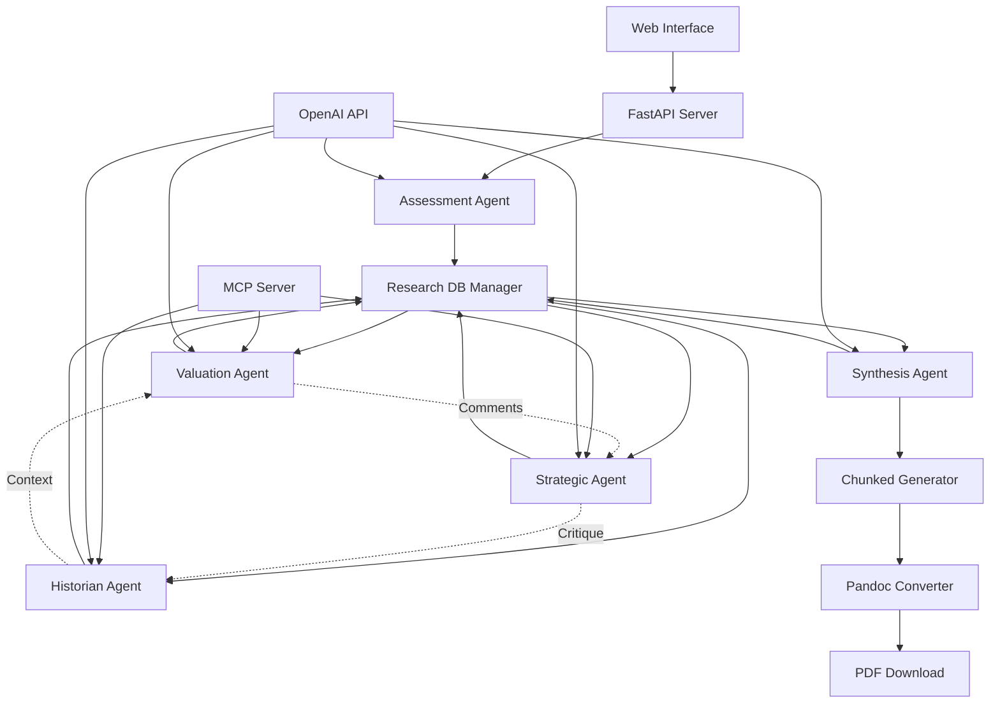

# Components

## Shared Research Database Manager

**Responsibility:** Manages the file-based research database where agents contribute and access structured markdown research files

**Key Interfaces:**
- write_research(agent_name: str, topic: str, content: str) -> ResearchFile
- read_all_research(excluding_agent: str = None) -> str
- add_comment(commenting_agent: str, target_file: str, comment: str) -> None
- get_cross_references(file_path: str) -> List[str]
- update_file_index() -> None

**Dependencies:** File system, YAML processing, Markdown parsing

**Technology Stack:** Python file operations, PyYAML for metadata, python-markdown for processing

## Assessment Agent

**Responsibility:** Dynamically generates 20 contextual questions tailored to specific ticker and evaluates user financial expertise across general investing knowledge, ticker-specific understanding, sector expertise, and analytical sophistication to determine appropriate report complexity level

**Key Interfaces:**
- generate_contextual_assessment_questions(ticker: str) -> List[AssessmentQuestion]
- evaluate_user_expertise(questions: List[AssessmentQuestion], responses: List[AssessmentResponse], ticker: str) -> AssessmentResult
- determine_report_complexity(expertise_level: int) -> str

**Dependencies:** OpenAI API with unified question generation + evaluation prompt framework

**Technology Stack:** FastAPI endpoint, OpenAI SDK, Pydantic models for validation

## Valuation Expert Agent

**Responsibility:** Conducts deep financial analysis through MCP and web research, creates DCF models and peer comparisons, contributes structured valuation research to shared database

**Key Interfaces:**
- conduct_deep_valuation_research(ticker: str) -> PrivateResearchContext
- create_dcf_analysis(research_context: str) -> str (markdown)
- analyze_peer_comparison(research_context: str) -> str (markdown)
- write_valuation_summary(shared_db: ResearchDB) -> str (markdown)

**Dependencies:** MCP Server, OpenAI API, Shared Research Database, Financial data sources

**Technology Stack:** Direct OpenAI SDK calls, MCP integration, structured markdown output

## Strategic Analyst Agent

**Responsibility:** Researches competitive dynamics and market positioning, reads existing research database for context, contributes strategic analysis and critiques to shared knowledge base

**Key Interfaces:**
- conduct_strategic_research(ticker: str, existing_research: str) -> PrivateResearchContext  
- analyze_competitive_moat(research_context: str, valuation_insights: str) -> str (markdown)
- evaluate_market_dynamics(research_context: str) -> str (markdown)
- comment_on_valuation(valuation_files: List[str]) -> str (markdown comments)

**Dependencies:** Valuation Expert outputs, MCP Server, OpenAI API, Market research sources

**Technology Stack:** OpenAI SDK with strategic analysis prompts, research database integration

## Company Historian Agent

**Responsibility:** Researches complete company history, leadership evolution, and strategic decisions, integrates insights with existing valuation and strategic research

**Key Interfaces:**
- research_company_timeline(ticker: str) -> PrivateResearchContext
- analyze_leadership_track_record(research_context: str, strategic_insights: str) -> str
- document_crisis_management(research_context: str) -> str (markdown)
- provide_historical_context(valuation_files: List[str], strategic_files: List[str]) -> str

**Dependencies:** All previous agent outputs, Historical data sources, OpenAI API

**Technology Stack:** OpenAI SDK with historical research prompts, cross-reference capabilities

## Report Synthesis Agent  

**Responsibility:** Reads entire research database, generates comprehensive investment thesis through chunked generation with rolling context, produces adaptive final reports

**Key Interfaces:**
- read_complete_research_database() -> str (all .md files)
- generate_report_sections(expertise_level: int, research_context: str) -> List[Section]
- generate_section_with_context(section: Section, previous_content: str) -> str
- merge_sections_to_final_report(sections: List[str]) -> str (complete markdown)

**Dependencies:** Complete research database, OpenAI API, Pandoc for PDF conversion

**Technology Stack:** OpenAI SDK for synthesis, chunked generation logic, Pandoc integration

## Chunked Report Generator

**Responsibility:** Manages the generation of large reports by breaking them into sections, maintaining context between sections, and merging final output

**Key Interfaces:**
- determine_sections(expertise_level: int, research_db: ResearchDB) -> List[SectionSpec]
- generate_section(section_spec: SectionSpec, context: str) -> str
- preserve_context(current_content: str, max_tokens: int) -> str
- merge_sections(sections: List[str]) -> str

**Dependencies:** Report Synthesis Agent, Context management utilities

**Technology Stack:** Token counting, context window management, markdown merging utilities

## Pandoc PDF Converter

**Responsibility:** Converts final markdown reports to professional PDF format with institutional styling and typography

**Key Interfaces:**
- convert_to_pdf(markdown_content: str, template: str) -> bytes
- apply_institutional_template(content: str) -> str
- validate_pdf_output(pdf_bytes: bytes) -> bool

**Dependencies:** Pandoc installation, LaTeX engine (XeLaTeX), Custom templates

**Technology Stack:** Pandoc CLI integration, LaTeX template system, PDF validation

## Component Diagrams

