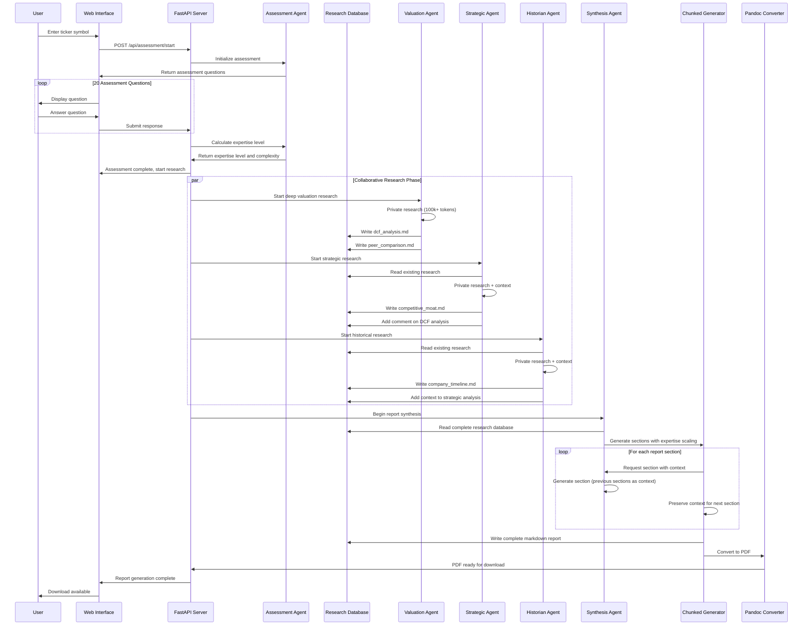

# Core Workflows

## Collaborative Research Workflow

```mermaid
sequenceDiagram
    participant User
    participant WebUI as Web Interface
    participant API as FastAPI Server
    participant Assessment as Assessment Agent
    participant DB as Research Database
    participant Valuation as Valuation Agent
    participant Strategic as Strategic Agent
    participant Historian as Historian Agent
    participant Synthesis as Synthesis Agent
    participant Chunked as Chunked Generator
    participant Pandoc as Pandoc Converter

    User->>WebUI: Enter ticker symbol
    WebUI->>API: POST /api/assessment/start
    API->>Assessment: Initialize assessment
    Assessment->>WebUI: Return assessment questions
    
    loop 20 Assessment Questions
        WebUI->>User: Display question
        User->>WebUI: Answer question
        WebUI->>API: Submit response
    end
    
    API->>Assessment: Calculate expertise level
    Assessment->>API: Return expertise level and complexity
    API->>WebUI: Assessment complete, start research
    
    par Collaborative Research Phase
        API->>Valuation: Start deep valuation research
        Valuation->>Valuation: Private research (100k+ tokens)
        Valuation->>DB: Write dcf_analysis.md
        Valuation->>DB: Write peer_comparison.md
        
        API->>Strategic: Start strategic research
        Strategic->>DB: Read existing research
        Strategic->>Strategic: Private research + context
        Strategic->>DB: Write competitive_moat.md
        Strategic->>DB: Add comment on DCF analysis
        
        API->>Historian: Start historical research
        Historian->>DB: Read existing research
        Historian->>Historian: Private research + context
        Historian->>DB: Write company_timeline.md
        Historian->>DB: Add context to strategic analysis
    end
    
    API->>Synthesis: Begin report synthesis
    Synthesis->>DB: Read complete research database
    Synthesis->>Chunked: Generate sections with expertise scaling
    
    loop For each report section
        Chunked->>Synthesis: Request section with context
        Synthesis->>Synthesis: Generate section (previous sections as context)
        Chunked->>Chunked: Preserve context for next section
    end
    
    Chunked->>DB: Write complete markdown report
    Chunked->>Pandoc: Convert to PDF
    Pandoc->>API: PDF ready for download
    API->>WebUI: Report generation complete
    WebUI->>User: Download available
```
