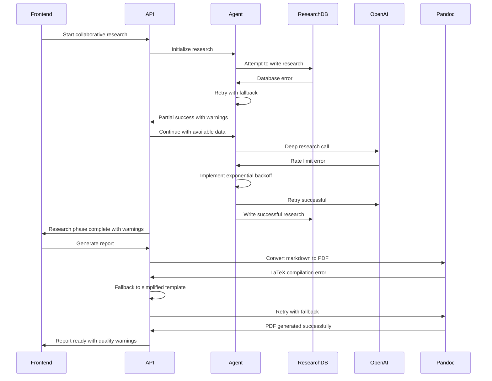

# Error Handling Strategy

## API Failure Recovery Patterns

**OpenAI Rate Limit Handling**: Exponential backoff with max retries
- Initial retry delay: 1 second, exponential backoff up to 60 seconds
- Maximum retry attempts: 5 with circuit breaker pattern
- Graceful degradation: Continue with cached/partial research data
- User notification: Real-time status updates during recovery

**MCP Server Failures**: Graceful degradation with cached data
- Fallback to cached financial data when available
- Alternative data source integration (web scraping as backup)
- Research continuation with available data sources
- Clear error messaging about data limitations

**Report Generation Failures**: Partial report delivery options
- Section-by-section recovery for chunked generation
- Fallback to simplified report template
- Markdown-only delivery if PDF conversion fails
- Research database preservation for manual review

**Agent Coordination Failures**: Continue with available agent outputs
- Independent agent execution when collaboration fails
- Research database fallback to individual agent contributions
- Comment system graceful degradation
- Final report synthesis with available research only

## Enhanced Error Flow



## Research-Specific Error Handling

```python