# High Level Architecture

## Technical Summary

StockIQ employs a collaborative multi-agent architecture with FastAPI as the orchestration backbone, featuring 5 specialized AI agents that contribute to a shared research database through structured markdown files. Each agent conducts deep private research (100k+ tokens) using MCP, web scraping, and OpenAI calls, then distills findings into high-quality .md files shared with other agents. The frontend consists of a minimal HTML/JavaScript interface, while the backend coordinates agent collaboration and chunked report generation using Pandoc markdown-to-PDF conversion. This architecture achieves institutional-grade analysis quality through agent specialization and collaboration, producing adaptive report outputs with dynamic scaling based on user expertise levels.

## Platform and Infrastructure Choice

**Platform:** Local Windows 11 Development
**Key Services:** 
- FastAPI application server
- OpenAI SDK for direct API calls
- Pandoc for markdown-to-PDF conversion
- Shared research database (file-based .md system)
- MCP integration for real-time financial data
- Git-like versioning for research contributions
**Deployment Host and Regions:** Local development only - no cloud deployment required

## Repository Structure

**Structure:** Research-centric monorepo with shared knowledge base
**Monorepo Tool:** None - using research database structure
**Package Organization:** Agent-based directories with shared research database

## High Level Architecture Diagram

```mermaid
graph TB
    User[User] --> Web[Web Interface]
    Web --> API[FastAPI Server]
    API --> Assessment[Assessment Agent]
    
    Assessment --> DB[(Shared Research Database)]
    Valuation[Valuation Expert] --> DB
    Strategic[Strategic Analyst] --> DB  
    Historian[Company Historian] --> DB
    Synthesizer[Report Synthesizer] --> DB
    
    DB --> Valuation
    DB --> Strategic
    DB --> Historian
    DB --> Synthesizer
    
    Valuation -.->|Comments/Critique| Strategic
    Strategic -.->|Comments/Critique| Historian
    Historian -.->|Comments/Critique| Valuation
    
    Synthesizer --> Chunked[Chunked Generation]
    Chunked --> Pandoc[Pandoc MD→PDF]
    Pandoc --> Download[Report Download]
    
    API --> MCP[MCP Server]
    MCP --> Financial[Financial Data]
    
    Valuation --> OpenAI[OpenAI API]
    Strategic --> OpenAI
    Historian --> OpenAI
    Synthesizer --> OpenAI
```

## Architectural Patterns

- **Collaborative Multi-Agent Research Database:** Agents contribute distilled insights via structured .md files while conducting deep private research - _Rationale:_ Enables institutional-grade depth without token limit violations, mimics real research team collaboration
- **Deep Research with Distilled Output:** Each agent can consume 100k+ tokens privately but only contributes high-quality summaries to shared context - _Rationale:_ Maximizes research depth while maintaining manageable shared context size
- **Markdown-Native Content Generation:** All outputs in markdown format for natural LLM writing and professional PDF conversion - _Rationale:_ LLMs write better markdown than HTML, Pandoc provides superior PDF formatting
- **Chunked Report Generation with Context Preservation:** Large reports generated in sections with rolling context from previous sections - _Rationale:_ Overcomes LLM output limits while maintaining coherence across 200-300 page reports
- **Dynamic Single Template Scaling:** One adaptive template that scales content based on expertise level - _Rationale:_ Simpler than multiple templates, allows fine-grained expertise-based customization
